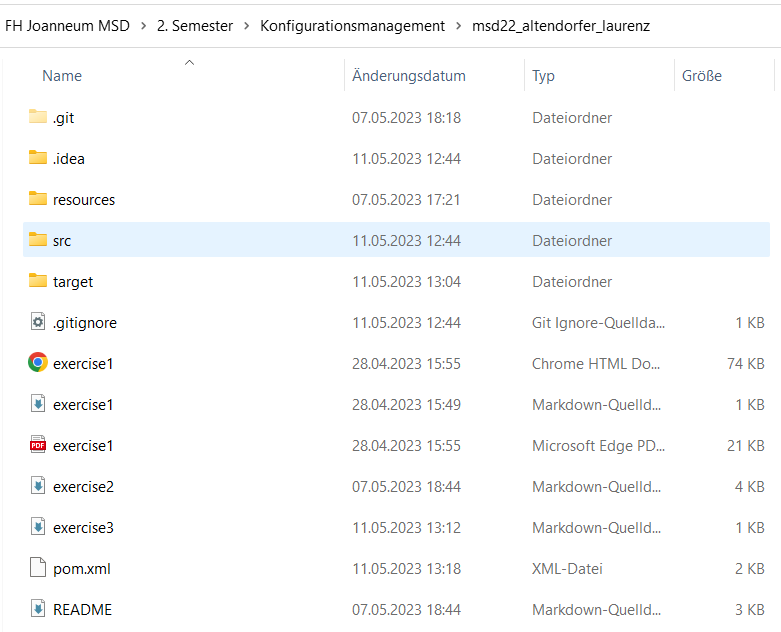
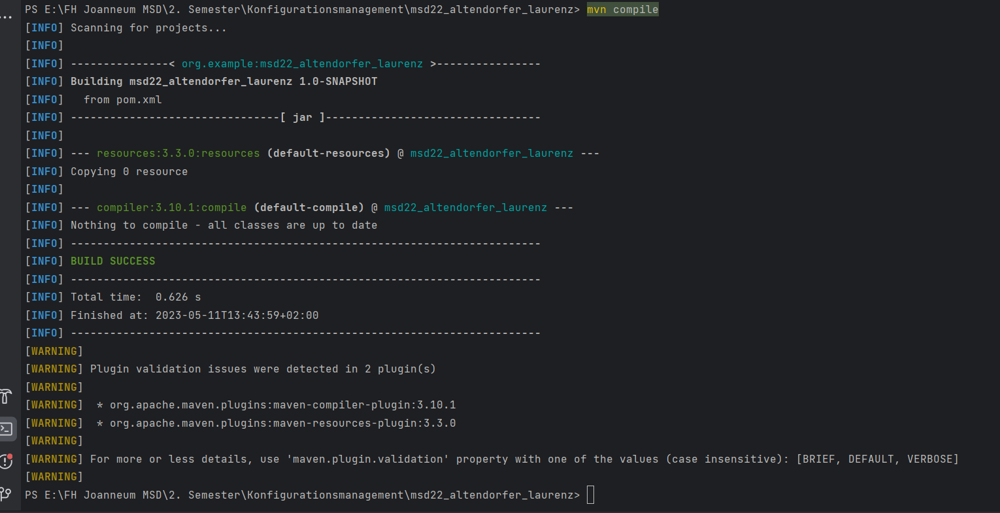

# Exercise 3 Maven

## Notes

Nach der Ausführung wurde der Ordner `target` im Projekt erstellt. 

## Screenshot
Hier sieht man einen Screenshot vom Dateisystem. Man kann hier auch zusätzlich den erstellten `target` Ordner sehen.

Hier ist der Screenshot von der Console nachdem `mvn compile` ausgeführt wurde

