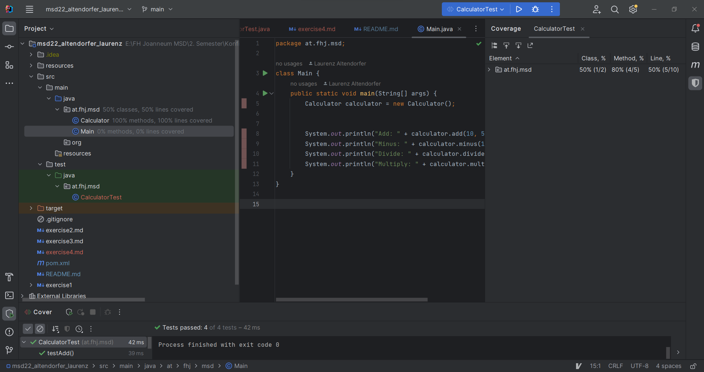
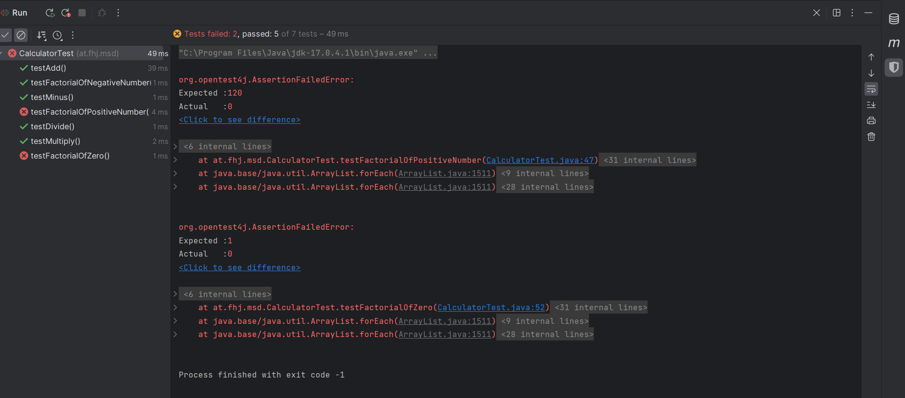

# Exercise 4

In dieser Übung testen wir die Calculator Klasse mit folgenden Test-cases:

### `add(double number1, double number 2)`
- Zwei postive Zahlen addieren: `add(10, 5)`sollte `15`zurückgeben.
- Eine negative und eine positive Zahl addieren: `add(-5, 5)`sollte `0`zurückgeben.
- Zwei negative Zahlen addieren: `add(-5, -5)` sollte `-10`zurückgeben.

### `minus(double number1, double number2)`
- Eine kleinere Zahl von einer größeren Zahl subtrahieren: `minus(10, 5)` sollte `5`zurückgeben.
- Eine Zahl von sich selbst subtrahieren: `minus(5, 5)` sollte `0`zurückgeben.
- Eine positive von einer negativen Zahl subtrahieren: `minus(-5, 5)` sollte `-10` zurückgeben.

### `divide(double number1, double number2)`
- Eine Zahl durch eine andere teilen: `divide(10, 5)` sollte `2` zurückgeben.
- Eine Zahl durch sich selbst teilen: `divide(5, 5)` sollte `1` zurückgeben.
- Eine negative Zahl durch eine postive teilen: `divide(-5, 5)` sollte `-1` zurückgeben.
- Spezialfall Division wurde in diesem Programm nicht berücksichtigt!

### `multiply(double number1, double number2)`
- Zwei positive Zahlen multiplizieren: `multiply(10, 5)` sollte `50` zurückgeben.
- EIne Zahl mit Null multiplizieren: `multiply(5, 0)`sollte `0`zurückgeben.
- Eine negative und eine positive Zahl multiplizieren: `multiply(-5, 5)` sollte `-25`zurückgeben. 

### Testcoverage

### Fehlgeschlagene Tests

Hier sieht man wie die Tests fehlschlagen, da die `factorial(int n)` Funktion noch nicht implementiert ist, sondern immer 0 zurückgibt. Ein Testcase wird als korrekt markiert, da dieser mit einer negativer Zahl arbeitet, was 0 zurückgeben sollte.